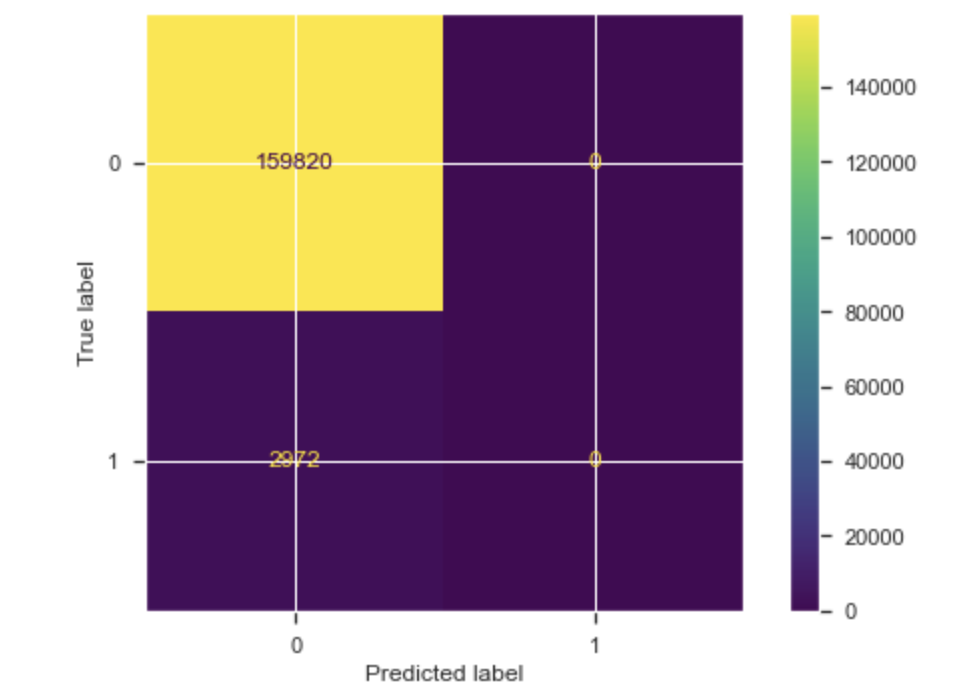
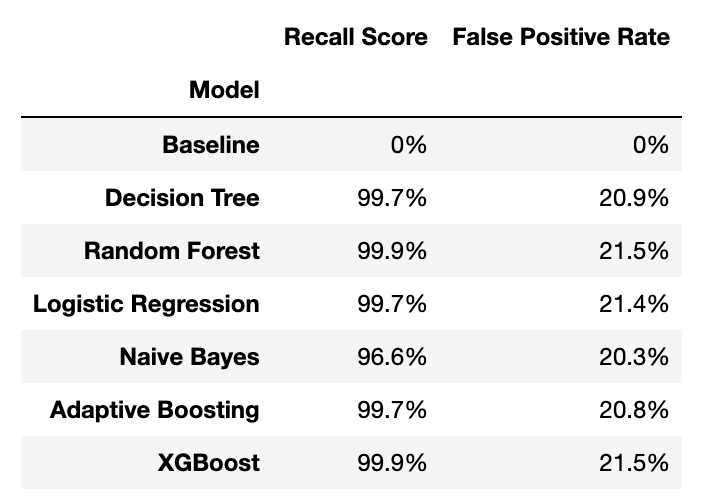

# Chicago Car Crash Safety Analysis

Predicting level of injury based on features of the car crash

## **Introduction**

	

TEST

Our client, an automobile manufacturer, is interested in increasing the safety rating of their upcoming line of new vehicles. They are considering the installation of a device that can detect when a crash has occured and predict whether or not EMS should be called to the scene automatically. Our task is to build a model capable of these predictions using data from the city of Chicago electronic crash reporting system. 

## **Exploratory Data Analysis**

We limited our analysis to features of this dataset that could theoretically be known by the proposed sensor device. Examples include weather conditions, time of day, vehicle type, contact area, and seatbelt use. We then binned our target variable - level of injury - into two classes: Accidents where an incapacitating or fatal injury occured and accidents with no serious reported injury. The distribution of our target is shown in *Figure 1*:

> *Figure 1*

Because of the large imbalance in our target class, we implemented class weight parameters during our modeling steps. The metrics we used to evaluate model performance were recall and false positive rate. Our stakeholder will value a high recall, meaning our model should identify the majority of crashes where a serious injury is likely. They will also value a low false positive rate, meaning our model should be able to distinguish which accidents are minor and reduce the risk of sending EMS when not neccessary.  

## **Baseline Model**

Our first model is a dummy classifier that defaults to always predicting the majority class. This model's confusion matrix is shown in *Figure 2:*

> *Figure 2*

This model is clearly ineffective --- although it has a low false positive rate, it's recall is also zero which is not useful for our busniess problem.

## **Model Selection**

Figure 3 below shows a table of the various models we tried according to their recall and false positive rates:

## **Log Scaling**

Upon examination, some features of the dataset appear to be heavily
skewed. For this reason, we used log-scaling on some target predictors
to create more normally distributed features. *Figure 5* shows the
square feet variable before and after log-scaling, and *Figure 6* shows
the same for our target variable, sale price.

> *Figure 5*

&nbsp;
&nbsp;
&nbsp;
&nbsp;

> *Figure 6*

## **Polynomial Regression**

We also investigated the effect of adding polynomial terms to the
regression model as some of the behavior was clearly nonlinear. *Figure
7* shows our MDAPE vs degree of polynomial, and we conclude that the
minimum possible error occurs at a degree of 4. Because of this, our
final model will incorporate a quartic function.

> *Figure 7*

## **Final Model**

*Figure 8* contains our final model, including our engineered features,
log scaling, and polynomic terms. The MDAPE for this model is 11.67% ---
A major improvement!

​​
> *Figure 8*

## **Testing on Unseen Data**

Finally, we want to test our model's predictive power against data that
it has not been exposed to before. *Figure 9* shows our model's
predictions vs true sale price for the training data (blue) and the
testing data (red). Our model's MDAPE was comparable on the testing
data, at 12.63%. This may indicate some minor overfitting which will be
addressed in future iterations.

>*Figure 9*

## **Conclusions**

We were able to improve from a baseline single linear regression model
MDAPE of \~28% to a final model MDAPE of \~12%. This final model was a
polynomial regression of degree 4, with engineered features, and
log-scaling of both predictor and target variables. All of the code to
generate the figures above can be found in this repository, under
'Final_Notebook.ipynb'.