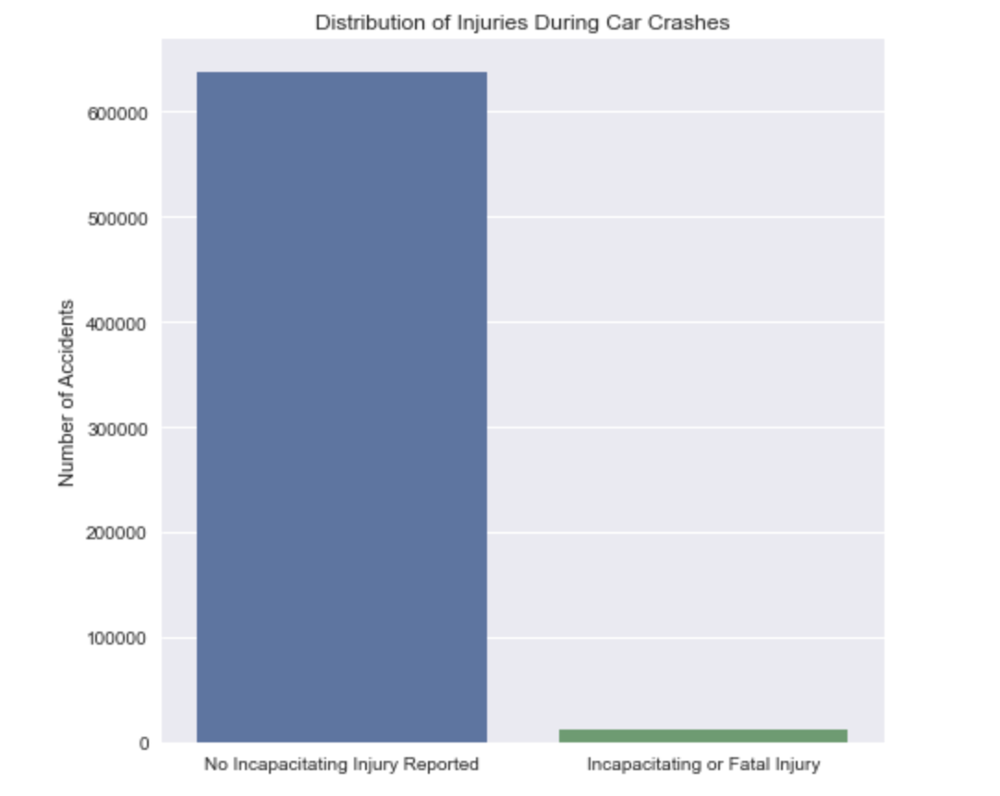
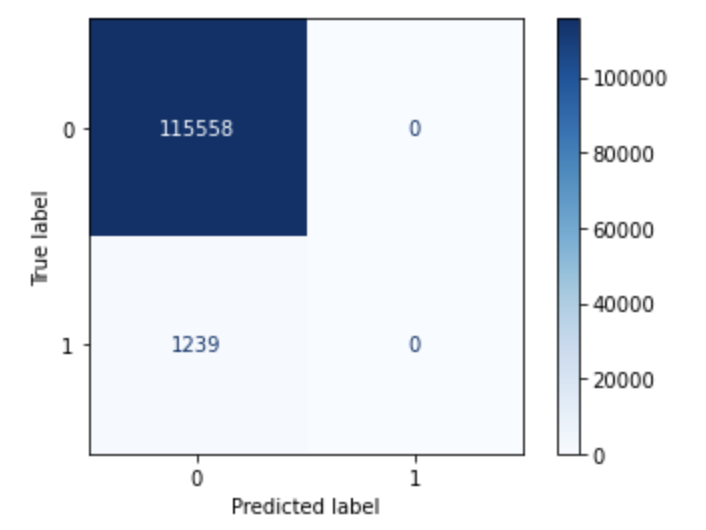

# Chicago Car Crash Safety Analysis

Predicting level of injury based on features of the reported accident

## **Introduction**

Our client, an automobile manufacturer, is interested in increasing the safety rating of their upcoming line of new vehicles. They are considering the installation of a device that can detect when a crash has occured and predict whether or not EMS should be called to the scene automatically. The benefits of such a device are two-fold: A decrease in emergency response time, and an increase in customer confidence in the safety of their vehicles. We have been asked to prove this device is plausible using machine learning. Our task is to build a model capable of these predictions using data from the city of Chicago electronic crash reporting system. 

## **Exploratory Data Analysis**

We limited our analysis to features of this dataset that could theoretically be known by the proposed sensor device. Primary examples include weather and road conditions, time of day, vehicle type, contact point, and seatbelt use. The final dataset consists of over 600,000 unique accidents from 2017 to present day. 

The original target variable was split into many subclasses of injury, ranging from no injury at all to fatal. We binned this column into a binary classificationg problem: Accidents where an incapacitating or fatal injury occured and accidents with no serious reported injury. This way, the model either predicts an ambulance is necessary or not, which aligns with the initial busness goal. The final distribution of our target is shown in *Figure 1*:

> *Figure 1*

Because of the large imbalance in our target class, it was necessary to implement balanced class weight parameters during our modeling steps. 

## **Performance Metrics**

In order to judge the performance of our model, we decided on two metrics:

### **Recall**

Our first performance metric is recall- a measure of our model's true positive rate. We would like our recall to be high, to maximize the probability that if someone is seriously injured in a crash, the model predicts this correctly and flags them for a potential EMS response.

### **False Positive Rate**

Our second performance metric is false positive rate (FPR)- a measure of how often our model misclassifies people as seriously injured when their injuries are non-incapacitating or there are no injuries at all. We want to minimize our FPR so that we avoid sending an ambulance to every minor fender bender in chicago.

## **Baseline Model**

Our first model is a dummy classifier that defaults to always predicting the majority class. This model's confusion matrix is shown in *Figure 2:*

> *Figure 2*

This model is clearly ineffective --- although it has a low false positive rate, it's recall is also zero which is not useful for our busniess problem.

## **Model Selection**

Figure 3 below shows a table of the various models we tried according to their recall and false positive rates:

## **Log Scaling**

Upon examination, some features of the dataset appear to be heavily
skewed. For this reason, we used log-scaling on some target predictors
to create more normally distributed features. *Figure 5* shows the
square feet variable before and after log-scaling, and *Figure 6* shows
the same for our target variable, sale price.

> *Figure 5*

&nbsp;
&nbsp;
&nbsp;
&nbsp;

> *Figure 6*

## **Polynomial Regression**

We also investigated the effect of adding polynomial terms to the
regression model as some of the behavior was clearly nonlinear. *Figure
7* shows our MDAPE vs degree of polynomial, and we conclude that the
minimum possible error occurs at a degree of 4. Because of this, our
final model will incorporate a quartic function.

> *Figure 7*

## **Final Model**

*Figure 8* contains our final model, including our engineered features,
log scaling, and polynomic terms. The MDAPE for this model is 11.67% ---
A major improvement!

​​
> *Figure 8*

## **Testing on Unseen Data**

Finally, we want to test our model's predictive power against data that
it has not been exposed to before. *Figure 9* shows our model's
predictions vs true sale price for the training data (blue) and the
testing data (red). Our model's MDAPE was comparable on the testing
data, at 12.63%. This may indicate some minor overfitting which will be
addressed in future iterations.

>*Figure 9*

## **Conclusions**

We were able to improve from a baseline single linear regression model
MDAPE of \~28% to a final model MDAPE of \~12%. This final model was a
polynomial regression of degree 4, with engineered features, and
log-scaling of both predictor and target variables. All of the code to
generate the figures above can be found in this repository, under
'Final_Notebook.ipynb'.